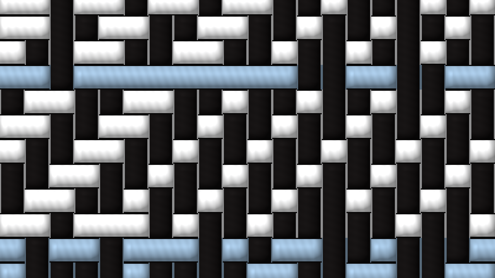
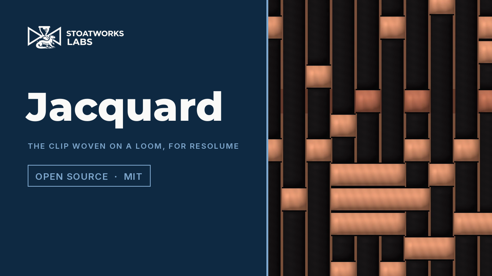

# jacquard

> **AI-assisted project.** This codebase was created with [Claude](https://claude.com/claude-code)
> (Anthropic), directed and reviewed by a human author. The weaving is not asserted but
> measured: an offline harness drives the real plugin class in a headless GL context and
> reads each claim back — every pick the loom weaves costs exactly what an exhaustive search
> over shuttle and pattern finds, on 960 woven picks and 200 arbitrary tables; no warp or weft
> float runs past Max Float in 48 cloths, counted on the grid and read back from the picture;
> each of eight weave structures shows exactly its stated weft ratio over 3,600 crossings; a
> twill's diagonal lands at exactly one end across per pick down; every pick shows one weft
> colour and it is a shuttle's; from a distance the cloth is nearer the picture than any
> single colour; the shuttles and the loom's memory survive a resize; the cloth is opaque
> over a clip with alpha; and over a black ground the ties scatter rather than line up down
> the ends — with nine negative controls that prove each check can fail, at two rasters and
> on a software renderer. It has **never been loaded into Resolume on macOS**;
> there it is loaded by [oxbow](https://github.com/stoatworks-labs/oxbow), which is a real FFGL
> host and is not Resolume. On Windows it has been gated in Resolume Arena 7.27.1 on software
> rendering. See [Status](#status).

The picture woven on a jacquard loom, as an FFGL effect for
[Resolume](https://resolume.com) Arena and Avenue.




<sub>Two frames rendered by `jqtest`, the offline harness — not captured from Resolume. The
test card at the defaults, then at Zoom 8x.</sub>

<!-- downloads:start -->

## Download

**[v0.1.0](https://github.com/stoatworks-labs/jacquard/releases/tag/v0.1.0)** — prebuilt for macOS and Windows. Pick your platform:

<details>
<summary><b>macOS</b> — Universal (Apple Silicon + Intel)</summary>

| Build | Download | Size |
| --- | --- | --- |
| Universal (Apple Silicon + Intel) · .dmg disk image | [`jacquard-0.1.0-macos-universal.dmg`](https://github.com/stoatworks-labs/jacquard/releases/download/v0.1.0/jacquard-0.1.0-macos-universal.dmg) | 249 KB |
| Universal (Apple Silicon + Intel) · .zip archive | [`jacquard-macos-universal.zip`](https://github.com/stoatworks-labs/jacquard/releases/latest/download/jacquard-macos-universal.zip) | 210 KB |

</details>

<details>
<summary><b>Windows</b> — x64</summary>

| Build | Download | Size |
| --- | --- | --- |
| x64 · .exe installer | [`jacquard-0.1.0-windows-x86_64-setup.exe`](https://github.com/stoatworks-labs/jacquard/releases/download/v0.1.0/jacquard-0.1.0-windows-x86_64-setup.exe) | 234 KB |
| x64 · .zip archive | [`jacquard-windows-x86_64.zip`](https://github.com/stoatworks-labs/jacquard/releases/latest/download/jacquard-windows-x86_64.zip) | 129 KB |

</details>

All builds, checksums and release notes: [github.com/stoatworks-labs/jacquard/releases](https://github.com/stoatworks-labs/jacquard/releases).

macOS builds are signed and notarised and open normally. The Windows builds are unsigned, so SmartScreen warns once.

<!-- downloads:end -->

## Video

[](https://www.youtube.com/watch?v=oaUX1lY2bRA)

## The one idea

At every crossing of a woven cloth one of two threads is on top: the **warp**, running
down, or the **weft**, running across. A jacquard head lifts every warp end on its own, so
any picture can be woven — but three constraints make a woven picture look woven:

1. **Colour comes from threads, not pixels.** One warp colour; and each row, a *pick*,
   carries **one weft colour** from the shuttles loaded. A pick cannot be two colours.
2. **Floats must be tied down.** A thread that passes over or under too many crossings in
   a row snags, so no float may run longer than **Max Float**, warp or weft, on either face.
3. **Tone is carried by weave structure.** A satin shows more weft than a twill, a twill
   more than a plain weave; a designer assigns structures to tones.

So a jacquard encoder is an optimiser under constraints. This plugin weaves the clip pick
by pick, top to bottom as a loom does, and chooses each pick's shuttle and its lift pattern
with an **exactly optimal** programme under both float limits. What falls out:

- **The twill's diagonal in the midtones**, and a satin's smooth face near the ends of the
  range: tone is posterised into regions of one structure, each phase-aligned to the grid so
  the diagonals run straight.
- **Colour banding along the picks.** A pick is one colour across the whole width, so where
  the picture wants two hues side by side the shuttles alternate from pick to pick and mix at
  a distance — the error each crossing is left with is carried to the next pick until one
  pays it.
- **Ties sprinkled through the solids.** A solid is one unbroken float; the programme ties
  it at least cost, and a tie out of satin order costs its speck twice, so the ties scatter
  in satin order. A pick's ties are always its own shuttle's colour, so a bright pick
  crossing a black ground leaves a scatter of specks. (v0.1.0 lined them up into short
  vertical dashes; v0.1.1 fixed it — see Status.)
- **A picture from across the room and thread up close.** Each crossing is drawn as its top
  thread, a lit cylinder that dips under at the end of every float, with the other thread in
  shadow in the gap; Zoom goes from the picture to the cloth.

### The honest limit

The loom weaves top to bottom and a pick cannot see the picks below it: each pick is exactly
optimal given the picks above, and the cloth as a whole is not a two-dimensional optimum.
Two saturated hues side by side weave as an uneven alternation, not two clean halves. There
is one weft a pick — no brocade or lampas mode. And the cloth is woven afresh every frame
with a memory of the last one, which holds a still clip still; how steady it is on footage
was measured once, by hand, and is not a check.

## Controls

| Group | |
| --- | --- |
| **Loom** | Ends (16–320 warp threads across), Picks (0 = Auto, or up to 320), Thread Aspect (a pick's height over an end's width, 0.5–2, with Picks on Auto), Max Float (2–16 crossings). |
| **Threads** | Warp Colour, Shuttles (2–8 weft colours), Palette (Clip — k-means of the clip — Heritage Dyes, Mono, Bright), Structure (Auto by Tone, Plain, Twill, Satin). |
| **Look** | Thread Shading (the lit thread; it fades out below a few pixels a crossing), Zoom (1–8x about the centre), Mix. |

The defaults are 160 ends, square crossings, floats of at most ten, a black warp, six
shuttles dyed from the clip and structure by tone, fully shaded, the whole cloth in view.
They were chosen by weaving Resolume's bundled demo clips through the harness; a black warp
keeps a black ground black.

## Status

**v0.1.1, released 25 September 2026, and honestly early.** v0.1.1 fixes the one defect
filming v0.1.0 found: ties over a black ground now scatter in satin order instead of lining
up into short vertical dashes (below). There is a
[user guide](https://stoatworks-labs.com/software/jacquard/guide/) ([PDF](docs/USER-GUIDE.pdf)),
a [project page](https://stoatworks-labs.com/software/jacquard/) and a
[browser demo](https://jacquard-demo.stoatworks-labs.com/). Everything below was measured on
the machine it was built on.

### Measured offline, on macOS

`tools/verify.sh` passes on this machine (M4 Max, macOS 26.4) against a fresh universal
Release build, running every picture check at **two rasters**, 320×180 and 1280×720, and
again at 320×180 on Apple's **software renderer**. What it establishes, in numbers:

| check | result |
| --- | --- |
| `--optimal` | 960 picks woven from 60 random cloths (4–13 ends, 2–8 shuttles, Max Float 2–6, every structure mode) and a second frame of each that remembers the first, plus 200 arbitrary integer tables: the programme's cost **equals** an exhaustive search over every shuttle and every pattern, exactly, on every one, and every table was feasible; the greedy weaver is worse on 54 of 480 |
| `--floats` | 48 cloths (four modes × card, noise, black, white × Max Float 2, 4, 6), counted on the grid and read back from the picture: **no float over the limit**, 0 infeasible picks |
| `--coverage` | each structure forced over a flat field, read from the picture over 60 × 60 crossings: warp satin 720, 3/1 twill 900, 2/1 1200, plain and 2/2 1800, 1/2 2400, 1/3 2700, weft satin 2880 — **exactly** 1/5, 1/4, 1/3, 1/2, 2/3, 3/4, 4/5; the tied solids **400 of 3,600**, one in nine, the satin minimum (612 in v0.1.0) |
| `--twill` | the autocorrelation's nearest peak at **exactly** one end across per pick down, in pixels: 45° for square crossings, 63.43° at Thread Aspect 2, 26.57° at 0.5 |
| `--shuttle` | on the card and a random picture with four shuttle sets: **0** crossings off the colour the grid says, **0** picks with two weft colours, **0** off the shuttles |
| `--distance` | 8 × 8-crossing blocks against the source, on the encoding: RMS error **0.58×** (shaded) and **0.53×** (flat) that of the best single colour at 1280×720 |
| `--resize` | through a change of raster the shuttles are bit-identical and the loom keeps its memory |
| `--alpha` | over a half-transparent card: alpha 255 everywhere at Mix 1, the source byte for byte at Mix 0, the blend to one step at Mix 0.5 |
| `--ties` | over a black ground crossed by bright picks (two figures and a bar; a disc; Max Float 6 and 10), read from the picture: a bright speck has a speck 1, 2 or 3 picks above it in the same end at most **0.52×** as often as chance (the tolerance is chance itself); v0.1.0's loom, kept as a negative control, **7.9–8.2×** |
| `--negative` | nine perturbed models — a greedy weaver, no float limit, heavier twills, twills that do not step, two wefts a pick, the wefts swapped after the weave, a loom that forgets on a resize, a cloth that takes the clip's alpha, v0.1.0's loom (byte-identical to the v0.1.0 binary on footage) — each **fails** its check |
| mutation | one character of the shipped GLSL (the lift read from the wrong channel) was caught by five checks at both rasters, then reverted; for v0.1.1, one character of the C++ cost (`kOffLattice` 1 → 0) was caught by `--ties` |
| `tools/sweep.py` | all **13** controls measurably change the picture, at 320×180 and 480×270 |
| shaders | all 3 compile through `glslc`, and none uses a GLSL 4.10 reserved word |
| `--pipe` | 2.5 frames in, exactly 2 out; an unknown cue refused (exit 2); a failed render and a closed stdout exit 1, not SIGPIPE; an option steps between cues |
| the bundle | universal (`x86_64 arm64`), exports `plugMain`, ad-hoc signs; `oxbow` reports `SW Jacquard` / `JQ01` / `effect` and renders 120 frames through `plugMain` |

Render cost, best of three runs of 30 frames after a warm-up, `glFinish` both sides, on a
machine shared with other builds:

| grid | 1280×720 | 1920×1080 | 3840×2160 | of which the CPU encoder |
| --- | --- | --- | --- | --- |
| defaults, 160 × 90 crossings | 1.8 ms | 2.0 ms | 2.0 ms | 1.3 ms |
| largest, 320 × 180 crossings | 5.5 ms | 5.7 ms | 6.7 ms | 4.7 ms |

(v0.1.1's `verify.sh`, 2026-09-25; v0.1.0's read 2.0–2.1 ms and 5.6–6.9 ms.)

### In Resolume Arena, on Windows

On Windows it has: the v0.1.1 DLL release.yml built from this source loads in Resolume Arena 7.27.1 on software rendering (win-lab, Mesa llvmpipe, no GPU), registers as `SW Jacquard` / `JQ01` / effect, all 19 host controls match what the plugin declares, it renders, Arena's log stays clean, and all 14 valued controls move the picture (38 to 68 levels against a noise floor of 0): 9 of the fleet Arena gate's 9 checks, one run on 2026-09-25 (v0.1.0's DLL passed the same 9, with 35 to 66). The gate's picture is a still, so it says nothing about how the cloth moves; software rendering says nothing about a GPU or about speed. MSVC compiled it first time.

### v0.1.1: ties over black scatter

Filming v0.1.0 found that where a bright pick crosses a black ground the ties sat in the
same ends pick after pick. The cause was measured, not guessed: the error the loom carries
down the cloth varies from end to end even over flat black, and it runs down the ends, so a
bright tie cost least in the same few ends every pick, by five times the lattice's
preference for satin order. v0.1.1 charges a tie out of satin order its speck twice, which
only the picture itself can outweigh, picks the lattice's step as a weaver picks a satin
counter (ties as far apart as the period allows), and doubles the memory's hold on each
pick's shuttle so busy footage is no less steady. Measured over Resolume's demo clips
through `--pipe` at 960×540: on the dancers a bright speck over black had a speck two picks
above it 26% of the time, and now 0.1%; the share of pixels changing from frame to frame
went from 13.2% to 11.3% there, and no clip measured changes more than in v0.1.0 (the
skulls 28.3% → 27.4%, SpaceUniverse 1.5% → 1.5%, a held frame 0% → 0%); the far error moved
by −4% to +2%. The new `--ties` check holds it. The project video shows v0.1.0.

### What filming the release video found

The video is rendered through `jqtest --pipe` over Resolume's demo clips. Filming found no
defect in the code, and three facts now in the guide (the second fixed in v0.1.1). **Plain on a grey clip loses the picture
entirely**: every crossing is the same plain weave and a pick is one shuttle, so only each pick's
average is left, and a grey clip's rows all average alike. **Over a black ground crossed by a
bright pick the ties line up** into short vertical dashes with dark picks between, not a satin
scatter; it is there on a single frame, so it is the per-pick weave, not the memory (a scratch
build with the lift hold at 0 made the columns more regular, and doubled the frame-to-frame
change). And **steadiness on moving footage**, measured through `--pipe` at 960×540 as the share
of pixels changing by more than 8/255 from one frame to the next: a held frame 0.00%; the dancers
(Galactucity) 10.4% in the clip and 13.2% in the cloth; the skulls 76.9% and 28.3%; Metalive 18.6%
and 13.6%; SpaceUniverse 1.9% and 1.5%; Cyberspace's thin bright lines 7.5% and 16.9%, with one
frame in ten re-weaving half the picture.

### Not established

It has **never been loaded into Resolume on macOS**. Everything above was compiled, rendered
and measured offline against the real plugin class, plus an `oxbow` load. The look on footage
has been judged by eye, on Resolume's bundled demo clips through the harness's `--pipe`; so has
"thread up close". Steadiness is measured, not a check. No presets, no OpenFX port.

## Browser demo

[jacquard-demo.stoatworks-labs.com](https://jacquard-demo.stoatworks-labs.com/)
runs the plugin's own cells and render shaders in WebGL2, spliced in from
`source/Shaders.cpp` by `demo/tools/sync_shaders.py` and checked character for
character by `demo/tools/check_shaders.py` from `tools/verify.sh`. Its CPU half — the
k-means that dyes the shuttles and the loom with its exact row programme — is a
**hand port to JavaScript** (`demo/loom.js`), and nothing checks a port but a reader.
It was compared with the C++ at v0.1.0 and again at v0.1.1: the same cloth on every
crossing of 41 frames of fixed means (black grounds included since v0.1.1), and against
`jqtest --pipe` on the page's own input frames the same picture to within one 8-bit level,
most frames on every pixel (see AGENTS.md). The
same limits hold there as here: each pick is exact given the picks above it and the
cloth is greedy between picks, the float limit is enforced inside each pick, one weft
colour a pick, and the output alpha is 1. Ends, Picks, Max Float and Shuttles are
dropdowns (the kit has no integer control). It is served from `demo/` by this repo's
own Worker and redeploys on every push to main.

## Build

Needs CMake 3.15+, a C++17 compiler, and the FFGL SDK submodule.

```bash
git clone --recursive https://github.com/stoatworks-labs/jacquard
cd jacquard
cmake -B build -DCMAKE_BUILD_TYPE=Release
cmake --build build --parallel
cmake --install build     # into ~/Documents/Resolume Arena/Extra Effects
```

macOS builds are universal (Apple Silicon + Intel) by default; add
`-DCMAKE_OSX_ARCHITECTURES=arm64` for a faster dev build. Windows needs GLEW via vcpkg.

## Building and testing

The offline harness renders the real plugin class headlessly:

```bash
./build/jqtest --out /tmp/frame.png --size 1920x1080   # the test card
./build/jqtest --list                                  # every control, kind and default
./build/jqtest --optimal                               # the programme against an exhaustive search
./build/jqtest --floats --coverage --twill             # each claim, measured on the picture
./build/jqtest --shuttle --distance --resize --alpha
./build/jqtest --ties                                  # over black, ties scatter
./build/jqtest --negative                              # and the checks can fail
./build/jqtest --bench                                 # 720p, 1080p and 4K
python3 tools/sweep.py                                 # no control is silently dead
tools/verify.sh                                        # all of it, on a fresh universal build
```

Every check takes `--size`; run it at 320×180 as well as the raster you care about, and with
`JQTEST_RENDERER=software` for the renderer CI has. Footage goes through the real plugin with
`--pipe`, in the fleet's frame format:

```bash
ffmpeg -i in.mov -f rawvideo -pix_fmt rgba - \
  | ./build/jqtest --pipe --size 1920x1080 --script cues.txt \
  | ffmpeg -f rawvideo -pix_fmt rgba -s 1920x1080 -i - out.mov
```

See [`CLAUDE.md`](CLAUDE.md) for the full command reference and
[`AGENTS.md`](AGENTS.md) for the model and the traps.

<!-- attributions:start -->
This project is built on other people's work — see [ATTRIBUTIONS.md](ATTRIBUTIONS.md).
<!-- attributions:end -->

## Licence

MIT — see [LICENSE](LICENSE).
