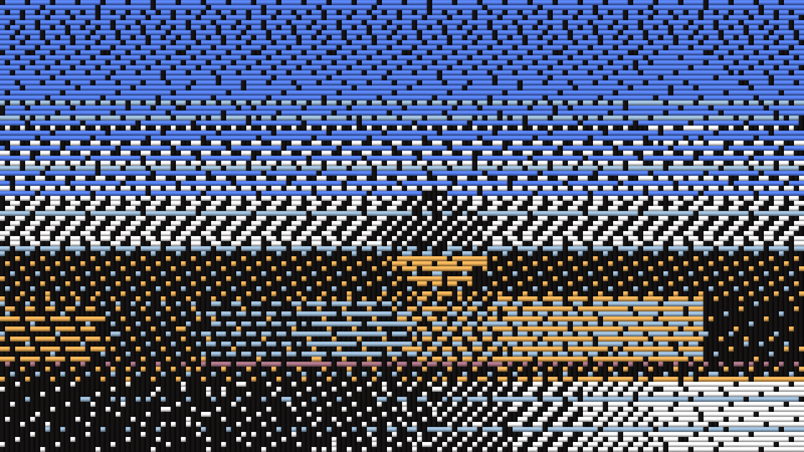

# Jacquard user guide

Jacquard is **the clip woven on a jacquard loom, for [Resolume](https://resolume.com) Arena and
Avenue**, as an FFGL effect. It is not a woven texture laid over the picture. The plugin weaves
the clip itself, pick by pick, under the three constraints a real loom works under: one warp
colour, one weft colour a pick from the shuttles loaded, and no thread floating past more than
**Max Float** crossings. Tone is carried by the weave structure. The look falls out of the
constraints: colour in horizontal bands, the diagonal of a twill in the midtones, ties sprinkled
through the solids, and a picture from across the room that is thread up close.



*The fleet's test card through the plugin at its defaults, rendered by the offline harness
rather than captured from Resolume: 160 ends, square crossings, floats of at most ten, a black
warp and six shuttles dyed from the picture.*

> **Before you rely on this:** released at **v0.1.1**, and honestly early. The weaving is
> measured rather than asserted, by a harness that drives the real plugin class headlessly, at
> two rasters and on a software renderer: every pick the loom weaves costs exactly what an
> exhaustive search over every shuttle and every lift pattern finds, on 960 woven picks and 200
> arbitrary tables; no warp or weft float runs past Max Float in 48 cloths, counted on the grid
> and read back from the picture; each of eight weave structures shows exactly its stated weft
> ratio over 3,600 crossings; a twill's diagonal lands at exactly one end across per pick down;
> every pick shows one weft colour and it is a shuttle's; from a distance the cloth is nearer
> the picture than any single colour; the shuttles and the loom's memory survive a resize; the
> cloth is opaque over a clip with alpha; and over a black ground the ties scatter rather than
> line up down the ends. Nine deliberately broken models are each shown to fail their check, and all 13 controls are shown to change the picture. **Each pick is optimal
> given the picks above it; the cloth as a whole is not** (see How it works). It has **never been
> loaded into Resolume on macOS** — the one host it has run in there is the fleet's own test
> host, `oxbow`, for 120 frames.
> On Windows it has: the DLL release.yml built from this source loads in Resolume Arena 7.27.1 on software rendering (win-lab, Mesa llvmpipe, no GPU), registers as `SW Jacquard` / `JQ01` / effect, all 19 host controls match what the plugin declares, it renders, Arena's log stays clean, and all 14 valued controls move the picture (35 to 66 levels against a noise floor of 0): 9 of the fleet Arena gate's 9 checks, one run. The gate's picture is a still, so it says nothing about how the cloth moves; software rendering says nothing about a GPU or about speed. MSVC compiled it first time.
> Try it on a spare layer before you put it in a show.
>
> This codebase was created with AI assistance, directed and reviewed by a human author.

---

## Installing

Every download carries one effect, **SW Jacquard**. Drop it into Resolume's effects folder and
restart Resolume:

```
macOS    ~/Documents/Resolume Arena/Extra Effects/
Windows  %USERPROFILE%\Documents\Resolume Arena\Extra Effects\
```

Avenue uses the same layout under its own folder name. The effect then appears in the effects
browser as **SW Jacquard**.

The macOS download is a universal build (Apple silicon and Intel), as a `.dmg` or a `.zip`. It is Developer ID-signed and notarised (the downloaded `.dmg` and the bundle inside the `.zip` both read `Notarized Developer ID`), so the bundle simply loads. The Windows download is an x64 installer or a `.zip`. It is not
code-signed, so the installer trips SmartScreen once: **More info** → **Run anyway**.

---

## How a loom makes a picture

At every crossing of a woven cloth one of two threads is on top: the **warp**, running down
(each warp thread is an *end*), or the **weft**, running across (each row is a *pick*). A
jacquard head lifts every end on its own, so any pattern of crossings can be woven — but three
constraints make a woven picture look woven, and the plugin keeps all three:

| the constraint | what comes out |
| --- | --- |
| **one warp colour**, and **one weft colour a pick**, from the shuttles loaded | colour arrives in **horizontal bands**. Where the picture wants two hues side by side, the shuttles alternate from pick to pick and mix at a distance |
| **no float longer than Max Float**, warp or weft, on either face of the cloth | a solid area is one unbroken float and must be **tied**: ties are sprinkled through every solid, in satin order where nothing else decides |
| **tone is carried by weave structure** | a satin shows more weft than a twill, a twill more than a plain weave: the **twill's diagonal** in the midtones, a **satin's smooth face** near the ends of the range, and the tone **posterised** into regions of one structure |

So the plugin is an optimiser under constraints. Each pick's shuttle and its lift pattern are
chosen by a programme that is **exactly** optimal under both float limits, and the error each
crossing is left with is carried down to the next pick.

---

## Start here

Put SW Jacquard on a layer or a clip with **colour that fills the frame** — the bundled skulls
(NoHopeJustFear_44) are the best of the demo loops. Out of the box you get 160 ends across,
square crossings, floats of at most ten, a near-black warp, six shuttles dyed from the clip,
structure chosen by tone, and every thread shaded.

Then:

1. **Mix → 0 and back.** Compare the clip with the cloth. Each pick is one colour; the tone is in
   how much of the weft shows.
2. **Zoom → 8x.** The picture becomes cloth: every crossing is its top thread, a lit cylinder that
   dips under at the end of each float, with the black warp running down between the wefts.
3. **Structure → Twill**, then **Satin**, then **Plain.** Twill puts a diagonal through every
   tone; Satin gives smooth faces; Plain has no structure to vary at all, so the picture is
   carried by each pick's shuttle alone — on a grey clip it is gone (see Structure, below).
4. **Shuttles → 2.** Two weft colours for the whole cloth: a pick can be only one of them, so the
   picture is carried almost entirely by structure. **→ 8** gives the shuttles room for every
   hue.
5. **Palette → Heritage Dyes**, then **Bright.** Fixed dye sets instead of colours taken from the
   clip.
6. **Ends → 48.** Coarse cloth, thick threads. **Max Float → 2** ties every float within two
   crossings, which forces a near-checkerboard.

**Black grounds stay black** because the warp is near-black: where the clip is black the warp
shows. Every float still has to be tied, so a black ground crossed by a bright pick carries that
pick's colour as a scatter of specks, in satin order. (Before v0.1.1 they often lined up into
short vertical dashes; see "What changed in v0.1.1" under How it works.)

Every slider is declared to the host as 0 to 1. The value each position stands for is given with
each control below. Ends, Picks, Max Float and Shuttles are whole numbers, and Resolume shows them
as such.

---

## The Loom group

**Ends** (16 to 320, default 160). The number of warp threads across the frame. Each crossing
weaves the mean colour of the clip's pixels in its rectangle, in linear light. Fewer ends is a
coarser cloth with thicker threads.

**Picks** (0 = Auto, or 1 to 320; default Auto). The number of picks down the frame. On Auto
there are as many picks as make each crossing **Thread Aspect** times as tall as it is wide, so
160 ends on a 16:9 frame weave 90 picks. With Picks set, Thread Aspect does nothing.

**Thread Aspect** (0.5 to 2, logarithmic, default 1, slider 0.5). A pick's height over an end's
width, used only with Picks on Auto. Above 1 the crossings are tall and a twill's diagonal is
steep (63.4° at 2); below 1 they are wide and the diagonal is shallow (26.6° at 0.5).

**Max Float** (2 to 16 crossings, default 10). The longest a thread may pass over or under the
threads crossing it before it must be tied. It applies to both threads and both faces: no run of
more than Max Float warp-up crossings along a pick (the weft floating behind), none of weft-up
(the weft floating on the face), and the same down every end. A low Max Float forces ties
everywhere and makes the cloth near-checkerboard; a high one lets solids run smooth, with one tie
in Max Float + 1 at least. The limit is enforced inside every pick: an end that has already run
Max Float picks on one side is forbidden that side in the next pick, so every pick is exact under
both limits at once.

---

## The Threads group

**Warp Colour** (default a near-black, 0.08 / 0.07 / 0.07). The colour of every end. Resolume
shows it as a colour picker. The dark default is what keeps a VJ clip's black ground black: where
the picture is black the warp shows. A pale warp turns a black ground into a mesh of specks.

**Shuttles** (2 to 8, default 6). How many weft colours are loaded. Each pick takes exactly one
of them, chosen with its lift pattern. More shuttles means more hues; fewer means the tone is
carried by structure.

**Palette** (default Clip). Where the shuttles' colours come from:

| | |
| --- | --- |
| Clip | dyed from the clip every frame by k-means in linear light, seeded from the last frame's colours, so the shuttles follow the clip without jumping |
| Heritage Dyes | natural dyes, as a weaver's card reads them: iron black, undyed cream, madder, indigo, weld, weld over indigo, walnut, madder rose (the first Shuttles of them) |
| Mono | evenly spaced greys from black to white |
| Bright | a woven label's brights: black, white, red, blue, yellow, green, magenta, cyan (the first Shuttles of them) |

The fixed dye values are ours, picked by eye from what the dyes are known to give, not measured.

**Structure** (default Auto by Tone). Which weave structures the loom may use. Each has an exact
weft ratio — how much of the weft shows:

| mode | structures | |
| --- | --- | --- |
| Auto by Tone | warp solid, warp satin (1/5), 2/1 twill (1/3), 2/2 twill (1/2), 1/2 twill (2/3), weft satin (4/5), weft solid | the default: satins near the ends of the range, twills in the midtones, solids at the ends |
| Twill | 3/1 (1/4), 2/2 (1/2), 1/3 (3/4) | a diagonal through every tone |
| Satin | warp satin (1/5), weft satin (4/5) | smooth faces, the tone carried mostly by the shuttles |
| Plain | plain (1/2) | nothing to vary: every crossing is the same weave |

Each crossing takes the structure in its mode whose mix of its pick's shuttle and the warp is
nearest the target colour, so tone is posterised into regions of one structure. **Plain carries
the picture in the shuttles alone**, and a pick is one shuttle across the whole width, so all
that is left is each pick's average: on a grey clip whose rows all average alike, the picture is
gone. The release video shows exactly that. It is the constraint, not a fault.

---

## The Look group

**Thread Shading** (0 to 1, default 1). Draws each crossing as its top thread: a lit cylinder,
with a dip where a float ends and the thread goes under, a ply twist, a sheen in the thread's own
colour, and the other thread in shadow in the gap between two. At 0 each crossing is a flat
square of its top thread's colour. The shading fades out below about 4 pixels a crossing (and is
fully off at 2), because a cylinder drawn in two pixels can only alias: at the default 160 ends
on a 320-pixel-wide frame it does nothing.

**Zoom** (1 to 8x, logarithmic, about the frame centre, default 1x, slider 0). Enlarges the
cloth, nearest crossing, to see the threads. The cloth is woven at its grid, not re-woven for the
zoom.

**Mix** (0 to 1, default 1). The cloth over the clip. At 1 the output is opaque: a cloth has no
holes, and the transparent parts of a clip are woven as the black ground their colour is. At 0 it
is the clip, with its own alpha.

---

## How it works

Three stages a frame:

1. **Cells** (GPU). One linear-light mean colour per crossing, over the clip's pixels whose
   centres fall in its rectangle — at most 320 × 320 crossings — read back to the CPU.
2. **The loom** (CPU). The shuttles are chosen (k-means of the crossings for Clip, or a fixed
   set). Then the cloth is woven pick by pick, top to bottom, as a loom weaves it. For each pick:
   the target for each crossing is its mean plus the error carried down from the pick above; each
   crossing's structure is the one whose mix of warp and shuttle is nearest the target; and a row
   programme finds the shuttle and the lift pattern of least total cost under both float limits,
   exactly. The costs are integers: a crossing that follows its structure costs that structure's
   error, a tie costs a fixed amount plus the error of the thread it shows, less a discount on a
   satin-ordered lattice of preferred tie positions, and off that lattice the error of the thread
   it shows is charged twice. The error left over is carried 1/4, 1/2, 1/4 to the next pick.
3. **Render** (GPU). Per output pixel, through Zoom: the crossing, the thread on top, its colour,
   and Thread Shading's lit cylinder.

**Exact per pick, greedy between picks.** The harness checks every pick the loom weaves against
an exhaustive search over every shuttle and every lift pattern: they cost the same. But a pick
cannot see the picks below it, so the cloth as a whole is not a two-dimensional optimum. Two
saturated hues side by side weave as an uneven alternation, not two clean halves.

**It remembers the last frame.** Weaving afresh from scratch every frame would be chaotic: one
crossing's change near the top moves shuttles and ties all the way down. So each pick's costs
also charge a little for a lift, a shuttle or a structure that differs from the last frame's, and
a still clip weaves exactly the same cloth frame after frame (0.00% of pixels change on a held
frame). On moving footage the cloth changes about as much as the clip does. Measured through
the harness at 960 × 540 over four seconds of each clip, as the share of pixels changing by more
than 8/255 from one frame to the next (v0.1.1; v0.1.0 in brackets): the dancers (Galactucity)
10.4% in the clip and 11.3% in the cloth (13.2%); the skulls 76.5% and 27.4% (28.3%); the tumbling
sphere (Metalive) 18.5% and 12.0% (13.6%); the slow nebula (SpaceUniverse) 1.9% and 1.5% (1.5%).
On the thin bright lines of Cyberspace the cloth moves more than the clip (8.1% against 16.1%;
16.9%). There is no single steadiness figure, and it is not one of the harness's checks.

**What changed in v0.1.1: ties over black scatter.** In v0.1.0, where a bright pick crossed a
black ground, the ties sat in the same ends pick after pick and read as short vertical dashes.
The error the loom carries down the cloth varies a little from end to end even over flat black,
and it runs down the ends, so a bright tie cost least in the same few ends every pick — by five
times the loom's small preference for satin order. v0.1.1 charges a tie out of satin order the
error of its speck twice, which only the picture itself can outweigh; takes the satin's step as a
weaver takes a satin counter, so the ties lie as far apart as the float limit allows; and holds
each pick's shuttle from frame to frame twice as firmly, so busy footage is no less steady than
before. On the dancers, a bright speck over black had another speck two picks above it in the same
end 26% of the time in v0.1.0, and 0.1% in v0.1.1. A flat solid now ties exactly one crossing in
Max Float + 1. The error seen from a distance moved by between −4% and +2% on the demo clips.

---

## Performance

Measured by the offline harness on an M4 Max, best of three, `glFinish` both sides, on a machine
shared with other work:

| | 1280 × 720 | 1920 × 1080 | 3840 × 2160 | of which the CPU loom |
| --- | --- | --- | --- | --- |
| defaults, 160 × 90 crossings | 1.8 ms (11%) | 2.0 ms (12%) | 2.0 ms (12%) | 1.3 ms |
| largest, 320 × 180 crossings | 5.5 ms (33%) | 5.7 ms (34%) | 6.7 ms (40%) | 4.7 ms |

(percentages of a 60 fps frame).

The CPU half — the shuttles' k-means and the row programme for every pick — is most of the cost
and does not depend on the output resolution; it rises with the number of crossings. There is one
read-back a frame, of at most 1.6 MB. Nothing was timed inside Resolume, where the read-back is a
stall the host has to wait for, and nothing was timed on Windows.

---

## If it looks wrong

**The cloth is a flat grey mesh.** Structure is Plain on a clip with little colour: a plain weave
carries the picture only in the shuttles. Use Auto by Tone, or raise the clip's colour.

**The picture is striped across.** That is the one-weft-a-pick constraint: a pick is one colour
across the whole width. More Shuttles help; so does a clip whose colours change down the frame
more than across it.

**Two colours side by side come out as alternating lines.** Also the constraint: where the
picture wants two hues in the same pick, the loom alternates them pick by pick. From a distance
they mix.

**A black ground has specks in it.** Those are ties: every float must be tied within Max Float
crossings, and a pick's ties are its own shuttle's colour. They fall in satin order, one in
Max Float + 1 crossings along a pick. Raise Max Float for fewer ties. (If they line up into
vertical dashes, you have v0.1.0: update.)

**The threads look like flat squares.** Thread Shading fades out below about 4 pixels a crossing.
Lower Ends, or raise Zoom.

**The clip's transparency is gone.** The cloth is opaque above Mix 0. Lower Mix to see the clip's
own alpha again.

**SW Jacquard is not in the effects browser.** Check the folder under Installing, and that
Resolume was restarted.

**The effect does nothing at all.** A shader that will not compile looks exactly like that, and
the real message is in the log:

```
macOS    ~/Library/Logs/jacquard/jacquard.YYYY-MM-DD.log
Windows  %LOCALAPPDATA%\jacquard\logs\jacquard.YYYY-MM-DD.log
```

It records the GL vendor, renderer and version at load, which shader failed if one did, and any
buffer the plugin could not allocate.

---

## Known limits

- **Greedy between picks.** Each pick is exact given the picks above it; the cloth is not a
  two-dimensional optimum, and two saturated hues side by side weave as an uneven alternation.
- **One weft a pick.** There is no brocade or lampas mode (a supplementary weft that floats
  behind where it is not used), which is how a real jacquard gets two colours into one pick.
- **Satin order, not fewest ties.** Since v0.1.1 the ties keep to a satin lattice, so where a
  bright pick crosses a small patch of black the loom may spend one tie more than the fewest the
  float limit needs, rather than let the ties line up. A tie's own speck is still not fed back into
  the error carried down the cloth.
- **Steadiness is measured, not guaranteed**, and not a harness check; see How it works.
- **The cost constants and the shading are chosen, not derived**: the tie cost, the lattice
  discount and the off-lattice charge, the memory terms, and the thread's light and sheen. The fixed dye sets are picked by
  eye.
- **The look is judged by eye**, on Resolume's bundled demo clips through the harness. The
  harness proves the constraints, the structures and that each control moves the picture; nothing
  measures how woven it looks, beyond the distance check on the test card.
- **Never loaded into Resolume on macOS.** Everything numeric was compiled, rendered and measured
  offline against the real plugin class in a headless CGL context, plus an `oxbow` load.
- **Never seen on camera footage**, only on Resolume's bundled CG loops.
- **Only ever run on an Apple M4 Max**, although the macOS build contains an Intel slice. On
  Windows, see the note at the top of this guide.
- **No presets** and no OpenFX version.
- **There is a browser demo** at [jacquard-demo.stoatworks-labs.com](https://jacquard-demo.stoatworks-labs.com/).
  It is a port to a web page, not the plugin: the shaders are the plugin's own, run in WebGL2,
  but the CPU half — the k-means that dyes the shuttles and the loom's row programme — is a hand
  port to JavaScript that only a reader checks. It was compared with the C++ at v0.1.0 and again
  at v0.1.1 and wove the same cloth; the page lists what it does not reproduce.

---

## About

The last group, **About**, carries the plugin's name, version, licence and maker, and buttons
that open this user guide ([stoatworks-labs.com/software/jacquard/guide/](https://stoatworks-labs.com/software/jacquard/guide/)),
the project page, the source on GitHub and the support page in your browser.

## Reporting something

[github.com/stoatworks-labs/jacquard/issues](https://github.com/stoatworks-labs/jacquard/issues).
A screenshot, the Loom and Threads settings, and the composition's resolution and frame rate are
usually enough. If the effect did nothing, attach the log.
